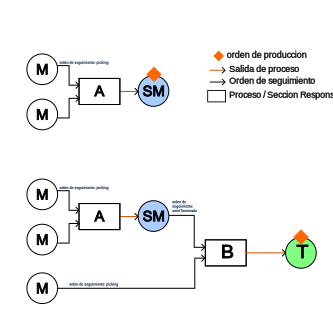

# FrontEnd Para Procesos Internos de ProduccionPage

## Modelamiento de Procesos




## Carga masiva de productos

La interfaz de carga masiva permite subir un archivo Excel con los productos.  
Desde esta versión es posible indicar qué columna corresponde a cada campo mediante un objeto de mapeo.  
Cada índice es **0-based**.

```ts
const formData = new FormData();
formData.append("file", excelFile);
formData.append(
  "mapping",
  new Blob(
    [JSON.stringify({
      descripcion: 0,
      unidadMedida: 1,
      stock: 4,
      productoId: 6,
      iva: 7,
      puntoReorden: 8,
      costoUnitario: 9
    })],
    { type: "application/json" }
  )
);
fetch("/bulk/products", { method: "POST", body: formData });
```

